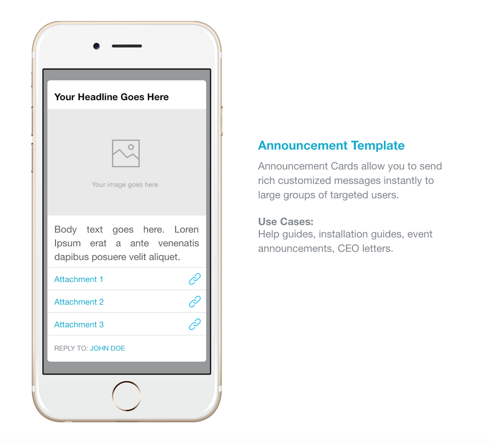
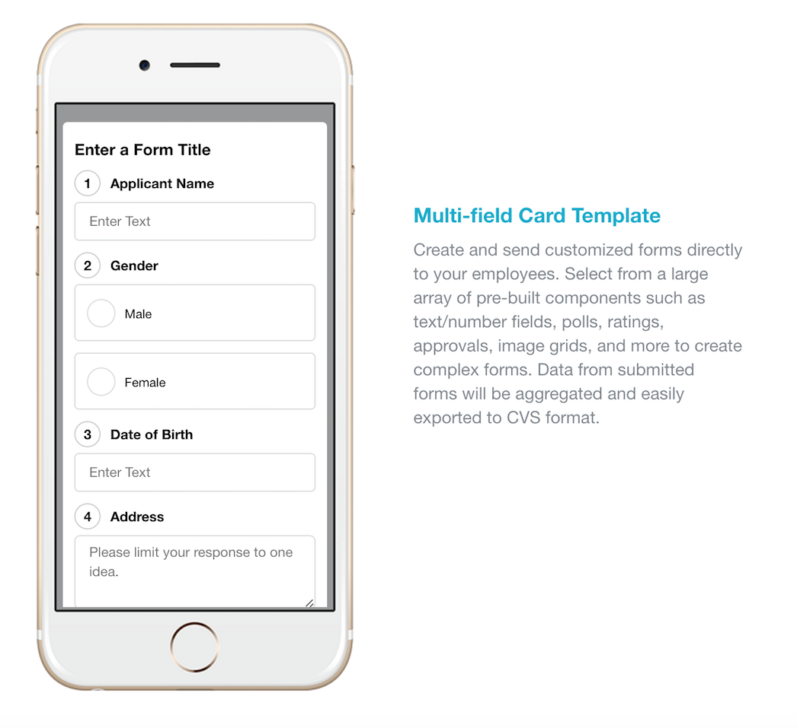
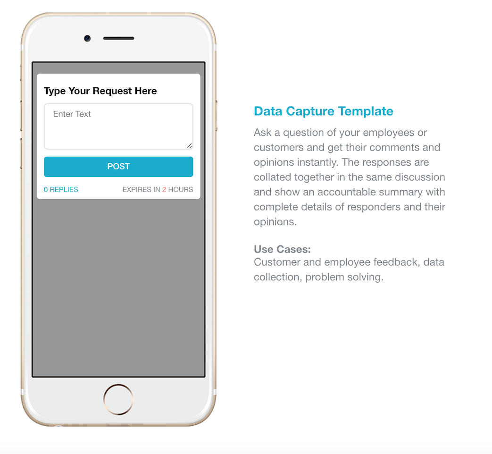
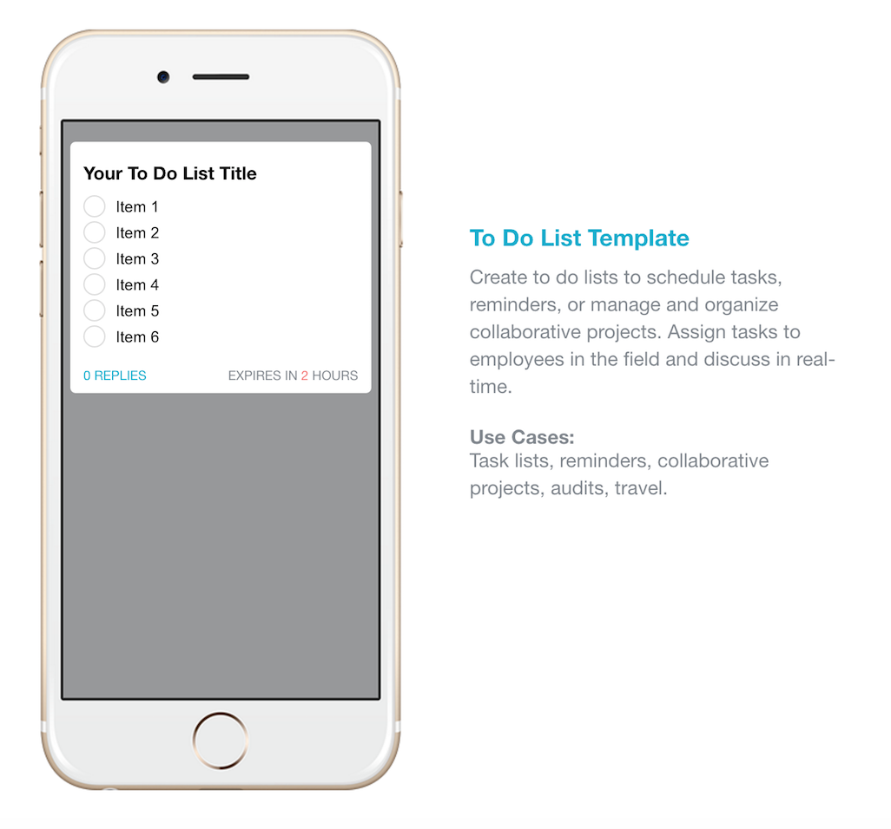
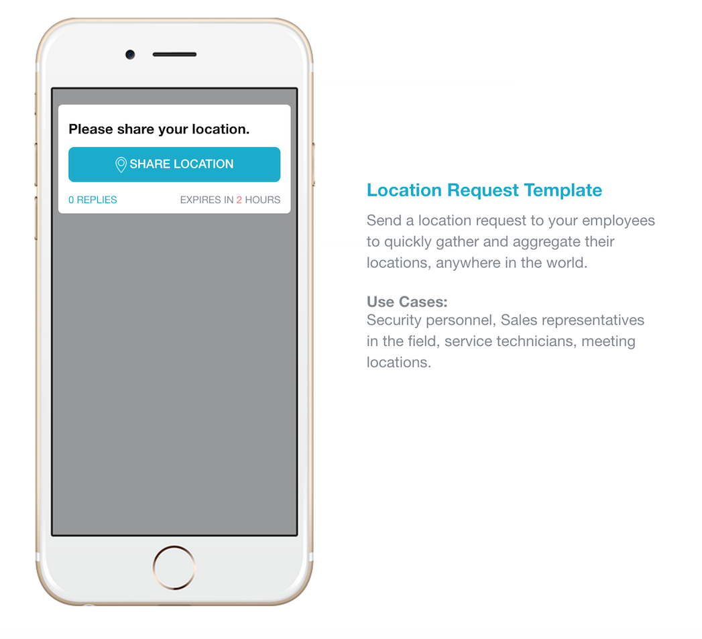
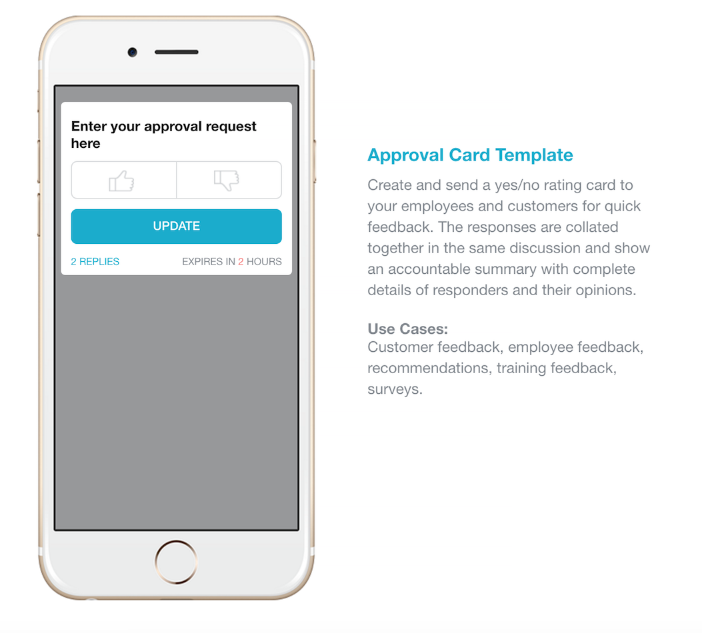
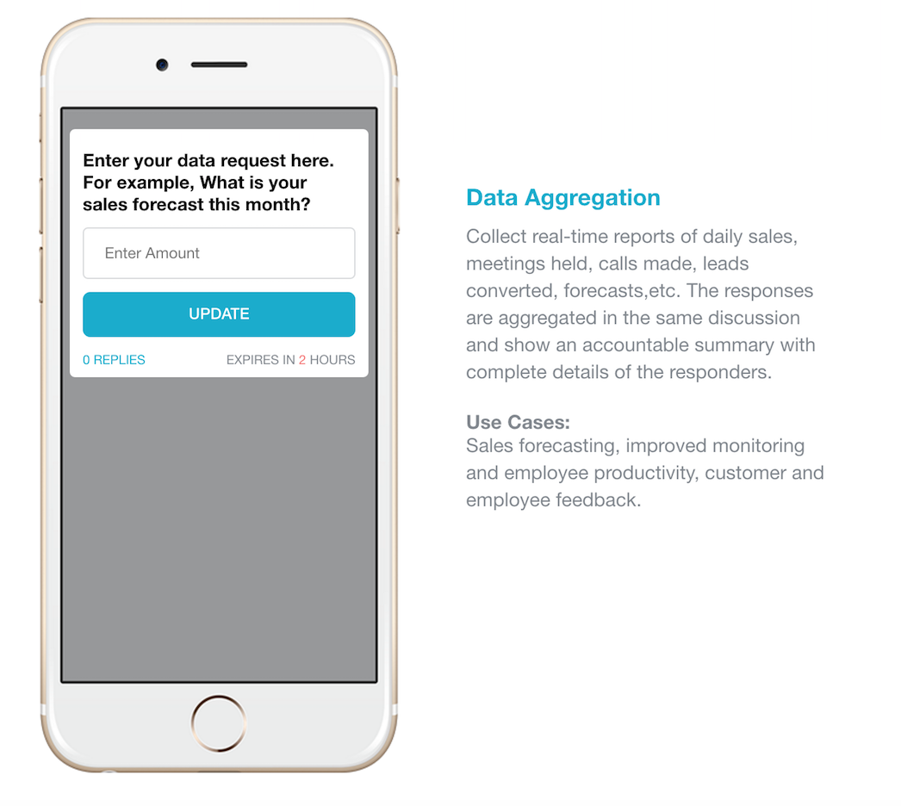

# Avaamo Dashboard SDK

##### [Setup](#setup-1)

## Groups
##### [Create a Group](#create-a-group-1)
##### [Add member to group](#add-member-to-group-1)
##### [Remove](#remove-member-from-group)
##### [Change admin](#change-admin-of-the-group)
##### [Update group](#update-group-details)
##### [List of members](#get-list-of-members-in-the-group)
##### [Get list of groups](#get-list-of-groups-1)

## Users
##### [Create user](#create-user-1)
##### [Get user details](#get-user-details-1)
##### [Update user details](#update-user-details-1)
##### [Invite user](#invite-the-user)
##### [Get all users](#get-all-users-1)
##### [Delete a user](#delete-a-user-1)

## Broadcasts
##### [Send AnnouncementCard](#send-announcementcard-1)
##### [Send CustomCard](#send-customcard-1)
##### [Send Poll](#send-poll-1)
##### [Send Data Capture](#send-data-capture-1)
##### [Send ToDo List](#send-todo-list-1)
##### [Send Rating Card](#send-rating-card-1)
##### [Send Location Card](#send-location-card-1)
##### [Send Approval Card](#send-approval-card-1)
##### [Send Data Aggregation Card](#send-data-aggregation-card-1)
##### [Get Broadcast audience](#get-broadcast-audience-1)
##### [Get All Broadcast cards](#get-all-broadcast-cards-1)
##### [Fetch Poll response](#fetch-poll-response-1)


#### Setup
Create a instance of AvaamoDashBoard
```java
AvaamoDashBoard avaamoDashboard = AvaamoDashBoard.create("<Provide your dashborad access token>");
```

## Groups

#### Create a Group
```java
NewGroup newgroup = new NewGroup();
newgroup.setName("Group Name");
newgroup.setDescription("Group Description");
newgroup.addUser(User.findUserByEmail("<email of the user>").getId());//User to be added to the group
Admin admin = new Admin(User.findUserByEmail("<email of the admin>").getId());
newgroup.setAdmin(admin);
try {
GroupResponse response = avaamoDashboard.getGroupManager().createGroup(newgroup);
} catch (IOException e) {
e.printStackTrace();
}
```
#### Add member to group
```java
//Add member to group
ArrayList<Integer> user_ids = new ArrayList<>();
User user1 = User.findUserByEmail("<email of the user>");
user_ids.add(user1.getId());
avaamoDashboard.getGroupManager().addMemberToGroup(<group_id>, user_ids);
```
#### Remove member from group
```java
avaamoDashboard.getGroupManager().removeMemberFromGroup(<group_id>, <user_id>);
```

#### Change admin of the group
```java
avaamoDashboard.getGroupManager().changeAdmin(<group_id>, <user_id>);
```

#### Update group details
```java
Group group = new Group(853);
group.setDescription("Description”);
group.setAvatarImage(new File("test_image.jpg"));
GroupResponse groupResponse = avaamoDashboard.getGroupManager().updateGroup(group);
```

#### Get list of members in the group
```java
GroupMembersResponse membersResponse= new GroupMembersResponse(<group_id>);
do{	
    ArrayList<GroupMember> group_members = membersResponse.getEntries();
}while(membersResponse.hasEntries());
```

#### Get list of groups
```java
GroupListResponse listResponse= new GroupListResponse();
do{	
	ArrayList<Group> users = listResponse.getEntries();
}while(listResponse.hasEntries());
```

## Users

#### Create user
```java
NewUser newuser = new NewUser();
newuser.setEmail("<email of the user>");
newuser.setPhoneNo("<phone no>");
newuser.setFirstName("<first name");
newuser.setLastName("<last name>");
try {
    int user_id = avaamoDashboard.getUserManager().createUser(newuser);
} catch (IOException e) {
e.printStackTrace();
}
```

#### Get User Details
```java
User user = avaamoDashboard.getUserManager().getUser(user_id);
```

#### Update user details
```java
User updatedUser = avaamoDashboard.getUserManager().updateUser(user);
```

#### Invite the user
```java
InviteUserTemplate template = new InviteUserTemplate();
template.setFromName("<Name>");
template.setSmsBody("sms body goes here");
template.setSubject("Invite from sdk dashboard");
template.setTemplate("Template of the invite message");
avaamoDashboard.getUserManager().inviteUser(user_id, template);
```

#### Get all users
```java
UserListResponse response= new UserListResponse();
do{	
ArrayList<User> users = response.getEntries();
}while(response.hasEntries());
```

#### Delete a user
```java
avaamoDashboard.getUserManager().deleteUser(user_id);
```

## Broadcasts

#### Send AnnouncementCard

```java
AnnouncementCard ac = new AnnouncementCard();

// set header line
ac.setHeadline("Annoucement Heading: Check this out@@@");
ac.setShowcaseImage(new File("test_image.jpg"));
ac.setBody("This is the test body. It can be minimal rich text too. " + "Like <b>Bold</b> <i>Italic</i>.");

// set sender name and avatar
ac.setSender(new Sender(1, "Sender Name", "Display name"));

//Received User can reply to these users
ac.addReplyTo(35545);//Passing user ids here.
ac.addReplyTo(36284);

//Add attachemnts like simple link, video link and files 
ArrayList<BroadcastAttachment> attachments = new ArrayList<>();
attachments.add(new BroadcastAttachment(Type.LINK,"Attachment 1","https://www.google.com"));
ac.setAttachments(attachments);

ac.addTargetUsersList(createSampleBroadcastList().getId());

// send the broadcast
avaamoDashboard.sendBroadcast(ac);
```
#### Send CustomCard

```java
CustomCard customCard = new CustomCard();

customCard.setHeadline("MultiField Card");
customCard.setSender(new Sender(1196,"SDK Sender", null));

// Add Questions
customCard.addQuestion(new Signature("Sign here for sdk"));

// Add a poll
Poll poll = new Poll("Is sdk usefull for you?");
poll.addOption(0, "Yes");
poll.addOption(0, "No");
customCard.addQuestion(poll);

// Add a rating question
Rating rating = new Rating("Rate this sdk");
rating.setStarCount(5);
rating.setStartCount(2);// These values don't reflect
customCard.addQuestion(rating);


// single line text field
customCard.addQuestion(new SingleLineText("Single line text field"));

// multiline text field
customCard.addQuestion(new DataCapture("Data capture field"));

// Display only label. This can take minimal HTML as well
customCard.addQuestion(new LabelField("Label  field"));

// yes or no question
customCard.addQuestion(new Approval("Yes/No  field"));

// Number field
customCard.addQuestion(new Aggregate("Aggregate  field"));

// To Do items field
Checklist checklist = new Checklist("CheckList  field");
checklist.addOption(0, "Option 1");
checklist.addOption(0, "Option 2");
customCard.addQuestion(checklist);

//File attachment field
File file = new File("test_image.jpg");
customCard.addQuestion(new FileLabel("File sending..", file));

//Set expiry in hours(Without expiry also servers accepts the card..should we allow that?)
customCard.setExpiresIn(2);

customCard.addTargetUsersList(245);//Target user list id. If you don't have one create using "createSampleBroadcastList()"
try {
  avaamoDashboard.sendBroadcast(customCard);
} catch (IOException e) {
  e.printStackTrace();
}

```

#### Send Poll

```java
CustomCard customCard = new CustomCard();
customCard.setHeadline("Simple Poll");
customCard.setSender(new Sender(1196,"Dashboard SDK Sender", null));

// Add a poll
Poll poll = new Poll(" What is your preference?");
poll.addOption(0, "Yes");
poll.addOption(1, "No");
poll.addOption(2, "May Be");
customCar.addQuestion(poll);

		
BroadcastList bl = new BroadcastList("Simple User List");
bl.addUser(User.findUserByEmail("<User email>"));
		
// set target users
customCard.addTargetUsersList(BroadcastListUtil.createBroadcastList(bl).getId());
		
// set poll expiration - in hours
customCard.setExpiresIn(2);
		
BroadcastCardResponse res = avaamoDashboard.sendBroadcast(customCard);
```

#### Send Data Capture

```java
CustomCard customCard = new CustomCard();
customCard.setHeadline("Only Data capture Card");
customCard.setSender(new Sender(1196,"SDK Sender", null));//1196 is sender id. To create a new sender pass 0

// multiline text field
customCard.addQuestion(new DataCapture("Data capture field"));

BroadcastCardResponse res = avaamoDashboard.sendBroadcast(customCard);
```

#### Send ToDo List

```java
CustomCard customCard = new CustomCard();
customCard.setHeadline("Simple ToDo");
customCard.setSender(new Sender(1196,"Dashboard SDK Sender", null));

// To Do items field
Checklist checklist = new Checklist("CheckList  field");
checklist.addOption(0, "Option 1");
checklist.addOption(1, "Option 2");
customCard.addQuestion(checklist);

BroadcastList bl = new BroadcastList("Simple User List");
bl.addUser(User.findUserByEmail("<User email>"));
		
// set target users
customCard.addTargetUsersList(BroadcastListUtil.createBroadcastList(bl).getId());
		
// set expiration - in hours
customCard.setExpiresIn(2);
		
BroadcastCardResponse res = avaamoDashboard.sendBroadcast(customCard);
```

#### Send Rating Card

```java
CustomCard customCard = new CustomCard();
customCard.setHeadline("Simple Rating Card");
customCard.setSender(new Sender(1196,"Dashboard SDK Sender", null));

// Add a rating question
Rating rating = new Rating("Rate this sdk");
rating.setStarCount(5);
rating.setStartCount(2);
customCard.addQuestion(rating);
		
BroadcastList bl = new BroadcastList("Simple User List");
bl.addUser(User.findUserByEmail("<User email>"));
		
// set target users
customCard.addTargetUsersList(BroadcastListUtil.createBroadcastList(bl).getId());
		
// set expiration - in hours
customCard.setExpiresIn(2);
		
BroadcastCardResponse res = avaamoDashboard.sendBroadcast(customCard);
```

#### Send Location Card

```java
CustomCard customCard = new CustomCard();
customCard.setHeadline("Simple Location Card");
customCard.setSender(new Sender(1196,"Dashboard SDK Sender", null));

// Add a location question
customCard.addQuestion(new Location("Please share your location"));
		
BroadcastList bl = new BroadcastList("Simple User List");
bl.addUser(User.findUserByEmail("<User email>"));
		
// set target users
customCard.addTargetUsersList(BroadcastListUtil.createBroadcastList(bl).getId());
		
// set expiration - in hours
customCard.setExpiresIn(2);
		
BroadcastCardResponse res = avaamoDashboard.sendBroadcast(customCard);
```

#### Send Approval Card

```java
CustomCard customCard = new CustomCard();
customCard.setHeadline("Simple Approval Card");
customCard.setSender(new Sender(1196,"Dashboard SDK Sender", null));

// yes or no question
customCard.addQuestion(new Approval("Yes/No  field"));
		
BroadcastList bl = new BroadcastList("Simple User List");
bl.addUser(User.findUserByEmail("<User email>"));
		
// set target users
customCard.addTargetUsersList(BroadcastListUtil.createBroadcastList(bl).getId());
		
// set expiration - in hours
customCard.setExpiresIn(2);
		
BroadcastCardResponse res = avaamoDashboard.sendBroadcast(customCard);
```

#### Send Data Aggregation Card

```java
CustomCard customCard = new CustomCard();
customCard.setHeadline("Simple Data Aggregation Card");
customCard.setSender(new Sender(1196,"Dashboard SDK Sender", null));

// Number field
customCard.addQuestion(new Aggregate("Enter the sales forecast this month?"));
		
BroadcastList bl = new BroadcastList("Simple User List");
bl.addUser(User.findUserByEmail("<User email>"));
		
// set target users
customCard.addTargetUsersList(BroadcastListUtil.createBroadcastList(bl).getId());
		
// set expiration - in hours
customCard.setExpiresIn(2);
		
BroadcastCardResponse res = avaamoDashboard.sendBroadcast(customCard);
```

#### Get Broadcast audience
```java
BroadcastAudienceResponse audienceResponse = new BroadcastAudienceResponse(4260);
do{	
	ArrayList<User> audiences = audienceResponse.getEntries();
}while(audienceResponse.hasEntries());
```

#### Get All Broadcast cards			
```java
AllBroadcastCardsResponse allCardsResponse = new AllBroadcastCardsResponse(75);
do{	
	ArrayList<BroadcastCardResponse> broadcast_cards = allCardsResponse.getEntries();
}while(allCardsResponse.hasEntries());
```

#### Fetch Poll Response
```java
BroadcastReplyManager replyManager = new BroadcastReplyManager(id);//Broadcast Id
ArrayList<Question> questions = replyManager.getBroadcastReply().getQuestions();

for (Question question : questions) {
	System.out.print(" "+question);
}
System.out.println();

ArrayList<BroadcastReplyElement> replyElements = replyManager.getBroadcastReply().getResponses();
for (BroadcastReplyElement broadcastReplyElement : replyElements) {
	System.out.println("----------------");
	System.out.println(""+broadcastReplyElement.getUser());
	ArrayList<Reply> replies  = broadcastReplyElement.getReplies();
	for(Reply reply:replies){
		System.out.print(" "+reply);
	}
	System.out.println();
	System.out.println("----------------");
}
```
			

